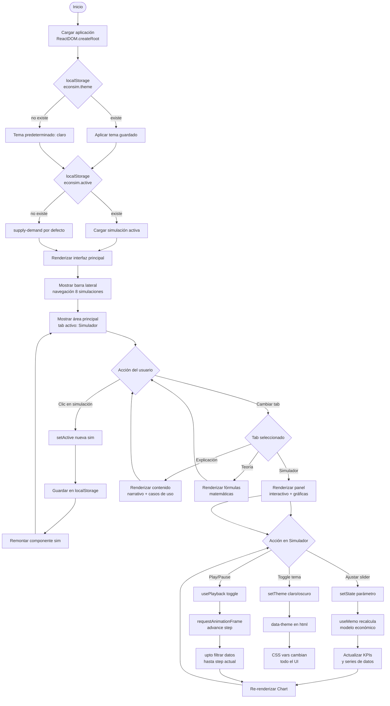
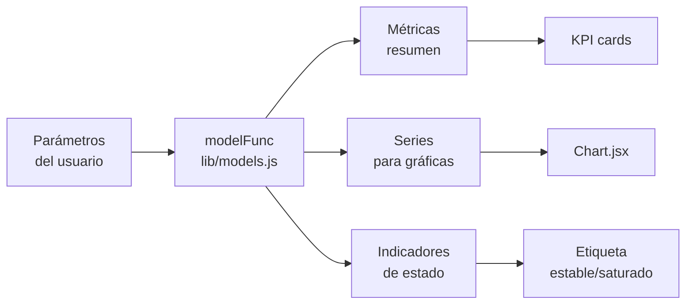
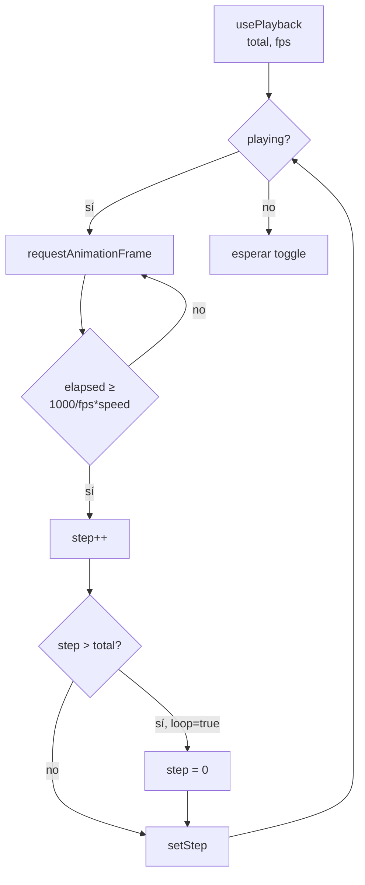

# Diagrama de Flujo — EconSim

## Flujo Principal de la Aplicación

```mermaid
flowchart TD
    A([Inicio]) --> B[Cargar aplicación\nReactDOM.createRoot]
    B --> C{localStorage\neconsim.theme}
    C -->|existe| D[Aplicar tema guardado]
    C -->|no existe| E[Tema predeterminado: claro]
    D --> F
    E --> F{localStorage\neconsim.active}
    F -->|existe| G[Cargar simulación activa]
    F -->|no existe| H[supply-demand por defecto]
    G --> I
    H --> I[Renderizar interfaz principal]

    I --> J[Mostrar barra lateral\nnavegación 8 simulaciones]
    J --> K[Mostrar área principal\ntab activo: Simulador]

    K --> L{Acción del usuario}

    L -->|Clic en simulación| M[setActive nueva sim]
    M --> N[Guardar en localStorage]
    N --> O[Remontar componente sim]
    O --> K

    L -->|Cambiar tab| P{Tab seleccionado}
    P -->|Simulador| Q[Renderizar panel\ninteractivo + gráficas]
    P -->|Explicación| R[Renderizar contenido\nnarrativo + casos de uso]
    P -->|Teoría| S[Renderizar fórmulas\nmatemáticas]

    Q --> T{Acción en Simulador}
    T -->|Ajustar slider| U[setState parámetro]
    U --> V[useMemo recalcula\nmodelo económico]
    V --> W[Actualizar KPIs\ny series de datos]
    W --> X[Re-renderizar Chart]
    X --> T

    T -->|Play/Pause| Y[usePlayback toggle]
    Y --> Z[requestAnimationFrame\nadvance step]
    Z --> AA[upto filtrar datos\nhasta step actual]
    AA --> X

    T -->|Toggle tema| BB[setTheme claro/oscuro]
    BB --> CC[data-theme en html]
    CC --> DD[CSS vars cambian\ntodo el UI]

    Q --> T
    R --> L
    S --> L
```

## Flujo de Cálculo de Modelo

```mermaid
flowchart LR
    P1[Parámetros\ndel usuario] --> M[modelFunc\nlib/models.js]
    M --> O1[Métricas\nresumen]
    M --> O2[Series\npara gráficas]
    M --> O3[Indicadores\nde estado]

    O1 --> K[KPI cards]
    O2 --> C[Chart.jsx]
    O3 --> S[Etiqueta\nestable/saturado]
```

## Flujo de Animación Temporal

```mermaid
flowchart TD
    A[usePlayback\ntotal, fps] --> B{playing?}
    B -->|sí| C[requestAnimationFrame]
    C --> D{elapsed ≥\n1000/fps*speed}
    D -->|sí| E[step++]
    E --> F{step > total?}
    F -->|sí, loop=true| G[step = 0]
    F -->|no| H[setStep]
    G --> H
    H --> B
    D -->|no| C
    B -->|no| I[esperar toggle]
```
