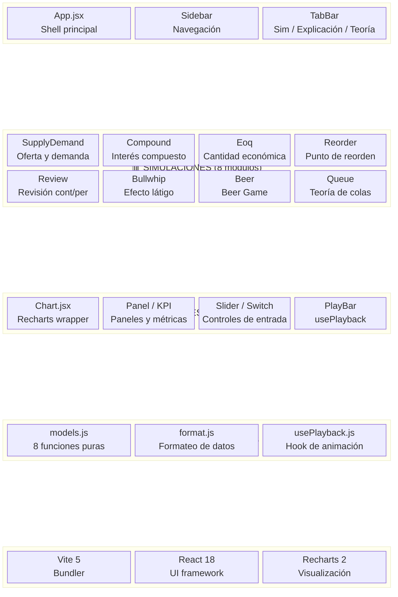
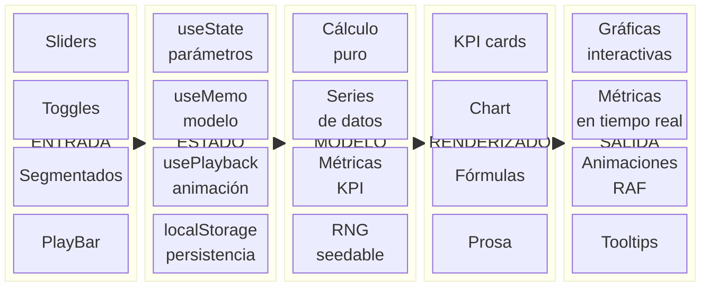

# Diagrama de Bloques — EconSim

## Arquitectura General del Sistema

```mermaid
block-beta
  columns 3

  block:UI["🖥️ CAPA DE PRESENTACIÓN"]:3
    columns 3
    A["App.jsx\nShell principal"]
    B["Sidebar\nNavegación"]
    C["TabBar\nSim / Explicación / Teoría"]
  end

  space:3

  block:SIMS["📊 SIMULACIONES (8 módulos)"]:3
    columns 4
    S1["SupplyDemand\nOferta y demanda"]
    S2["Compound\nInterés compuesto"]
    S3["Eoq\nCantidad económica"]
    S4["Reorder\nPunto de reorden"]
    S5["Review\nRevisión cont/per"]
    S6["Bullwhip\nEfecto látigo"]
    S7["Beer\nBeer Game"]
    S8["Queue\nTeoría de colas"]
  end

  space:3

  block:COMP["🧩 COMPONENTES COMPARTIDOS"]:3
    columns 4
    C1["Chart.jsx\nRecharts wrapper"]
    C2["Panel / KPI\nPaneles y métricas"]
    C3["Slider / Switch\nControles de entrada"]
    C4["PlayBar\nusePlayback"]
  end

  space:3

  block:LIB["📐 BIBLIOTECA DE MODELOS"]:3
    columns 3
    L1["models.js\n8 funciones puras"]
    L2["format.js\nFormateo de datos"]
    L3["usePlayback.js\nHook de animación"]
  end

  space:3

  block:INFRA["⚙️ INFRAESTRUCTURA"]:3
    columns 3
    I1["Vite 5\nBundler"]
    I2["React 18\nUI framework"]
    I3["Recharts 2\nVisualización"]
  end
```

## Bloques Funcionales Detallados

```mermaid
block-beta
  columns 5

  block:INPUT["ENTRADA"]:1
    columns 1
    U1["Sliders"]
    U2["Toggles"]
    U3["Segmentados"]
    U4["PlayBar"]
  end

  block:STATE["ESTADO"]:1
    columns 1
    ST1["useState\nparámetros"]
    ST2["useMemo\nmodelo"]
    ST3["usePlayback\nanimación"]
    ST4["localStorage\npersistencia"]
  end

  block:MODEL["MODELO"]:1
    columns 1
    M1["Cálculo\npuro"]
    M2["Series\nde datos"]
    M3["Métricas\nKPI"]
    M4["RNG\nseedable"]
  end

  block:RENDER["RENDERIZADO"]:1
    columns 1
    R1["KPI cards"]
    R2["Chart"]
    R3["Fórmulas"]
    R4["Prosa"]
  end

  block:OUTPUT["SALIDA"]:1
    columns 1
    O1["Gráficas\ninteractivas"]
    O2["Métricas\nen tiempo real"]
    O3["Animaciones\nRAF"]
    O4["Tooltips"]
  end

  INPUT --> STATE
  STATE --> MODEL
  MODEL --> RENDER
  RENDER --> OUTPUT
```
