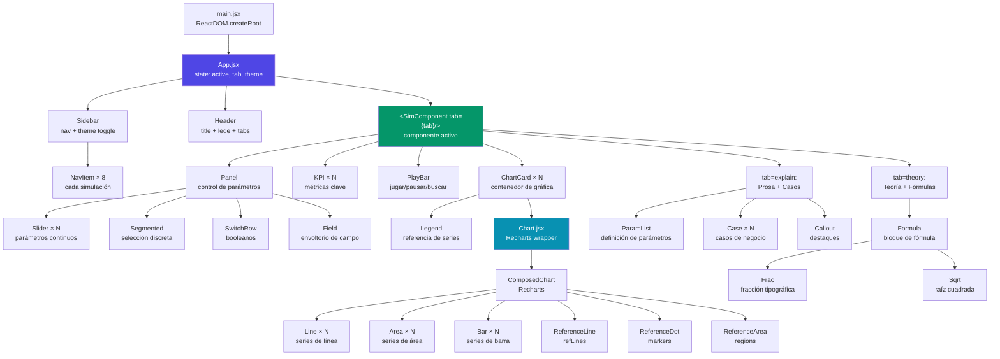
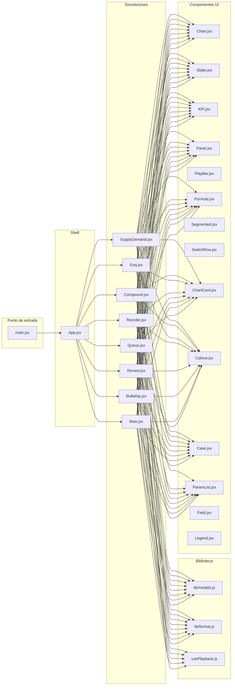

# Diagrama de Componentes — EconSim

## Jerarquía de Componentes React



## Árbol de Dependencias de Módulos



## Contratos de Props de Componentes Clave

```mermaid
classDiagram
    class Chart {
        +height: number
        +series: Serie[]
        +xDomain: number[]
        +yDomain: number[]
        +xLabel: string
        +yLabel: string
        +formatX: Function
        +formatY: Function
        +xTicks: number
        +yTicks: number
        +refLines: RefLine[]
        +regions: Region[]
        +markers: Marker[]
        +gridX: boolean
    }

    class Serie {
        +type: line|area|bar
        +data: number[][]
        +color: string
        +width: number
        +dash: string
        +opacity: number
        +name: string
    }

    class KPI {
        +label: string
        +value: string|number
        +unit: string
        +sub: string
        +color: string
    }

    class Slider {
        +label: string
        +value: number
        +min: number
        +max: number
        +step: number
        +onChange: Function
        +fmt: Function
        +unit: string
        +hint: string
    }

    class PlayBar {
        +playing: boolean
        +step: number
        +total: number
        +speed: 1|2|4
        +onToggle: Function
        +onReset: Function
        +onSeek: Function
        +onSpeed: Function
        +labelFmt: Function
    }

    class usePlayback {
        +step: number
        +setStep: Function
        +playing: boolean
        +toggle: Function
        +reset: Function
        +speed: number
        +setSpeed: Function
    }

    Chart --> Serie
    PlayBar --> usePlayback
