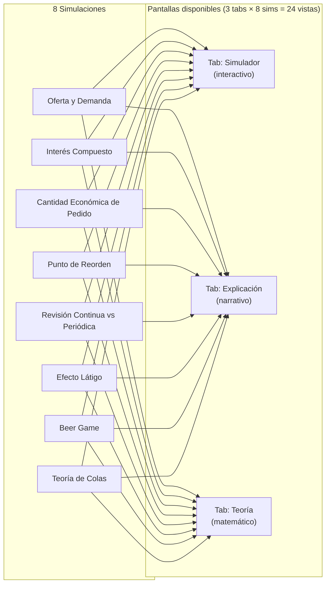
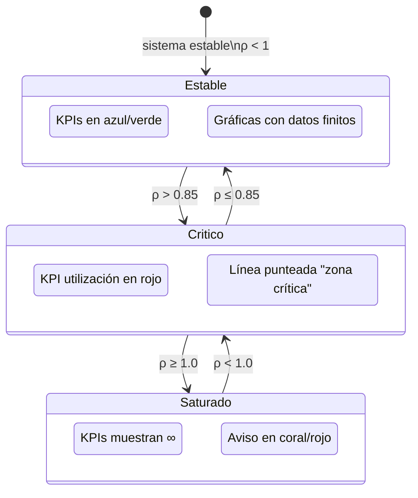
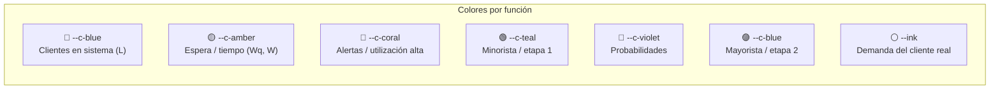

# Interfaz de Usuario — EconSim

## Mapa de Pantallas



## Layout General de la Interfaz

```
┌─────────────────────────────────────────────────────────────────────┐
│                          EconSim                            🌙/☀️   │
├──────────────┬──────────────────────────────────────────────────────┤
│              │  ┌─ TÍTULO DE SIMULACIÓN ──────────────────────────┐ │
│  BARRA       │  │  Kicker: Microeconomía                          │ │
│  LATERAL     │  │  Título: Oferta y Demanda                       │ │
│              │  │  Lede: descripción breve                        │ │
│  ① Oferta    │  └─────────────────────────────────────────────────┘ │
│    y demanda │                                                       │
│  ② Interés   │  ┌─ TABS ──────────────────────────────────────────┐ │
│    compuesto │  │  [Simulador]  [Explicación]  [Teoría]           │ │
│  ③ EOQ       │  └─────────────────────────────────────────────────┘ │
│  ④ Punto de  │                                                       │
│    reorden   │  ┌─ SIM-GRID ──────────────────────────────────────┐ │
│  ⑤ Revisión  │  │ ┌──────────────┐  ┌───────────────────────────┐ │ │
│  ⑥ Látigo    │  │ │    PANEL     │  │  ┌─ KPIs ───────────────┐ │ │ │
│  ⑦ Beer Game │  │ │  de control  │  │  │ KPI1 KPI2 KPI3 KPI4 │ │ │ │
│  ⑧ Colas     │  │ │              │  │  └─────────────────────┘ │ │ │
│              │  │ │  [Slider 1]  │  │                           │ │ │
│              │  │ │  [Slider 2]  │  │  [PlayBar] (si aplica)   │ │ │
│              │  │ │  [Slider 3]  │  │                           │ │ │
│              │  │ │  ──────────  │  │  ┌─ ChartCard ─────────┐ │ │ │
│              │  │ │  [Switch]    │  │  │ Título de gráfica   │ │ │ │
│              │  │ │              │  │  │                     │ │ │ │
│              │  │ │  Estado:     │  │  │   [GRÁFICA]         │ │ │ │
│              │  │ │  ✓ Estable   │  │  │                     │ │ │ │
│              │  │ └──────────────┘  │  └─────────────────────┘ │ │ │
│              │  │                   │                           │ │ │
│              │  │                   │  ┌─ ChartCard 2 ───────┐ │ │ │
│              │  │                   │  │   [GRÁFICA 2]       │ │ │ │
│              │  │                   │  └─────────────────────┘ │ │ │
│              │  │                   └───────────────────────────┘ │ │
│              │  └─────────────────────────────────────────────────┘ │
└──────────────┴──────────────────────────────────────────────────────┘
```

## Layout Tab "Explicación"

```
┌─────────────────────────────────────────────────────────────────────┐
│  [Simulador]  [Explicación]  [Teoría]                               │
├─────────────────────────────────────────────────────────────────────┤
│                                                                      │
│  Párrafo de introducción (lead)                                     │
│                                                                      │
│  A  ¿Qué hace esta simulación?                                      │
│     ──────────────────────────                                       │
│     Descripción narrativa del modelo...                             │
│                                                                      │
│  B  Significado de los parámetros                                   │
│     ──────────────────────────────                                  │
│     ┌───┬──────────────────────────────────────────────────┐       │
│     │ λ │ Tasa de llegadas — descripción completa          │       │
│     │ μ │ Tasa de servicio — descripción completa          │       │
│     │ c │ Número de servidores — descripción               │       │
│     └───┴──────────────────────────────────────────────────┘       │
│                                                                      │
│  C  Efectos que observarás                                          │
│     ────────────────────────                                         │
│     • Efecto 1                                                      │
│     • Efecto 2                                                      │
│                                                                      │
│  D  Utilidad en los negocios                                        │
│     ────────────────────────                                         │
│     ┌1─────────────────────────────────────────────────────┐       │
│     │ Caso de uso 1: título                                │       │
│     │ Descripción de aplicación real                       │       │
│     └─────────────────────────────────────────────────────┘       │
│     ┌2─────────────────────────────────────────────────────┐       │
│     │ Caso de uso 2...                                     │       │
│     └─────────────────────────────────────────────────────┘       │
└─────────────────────────────────────────────────────────────────────┘
```

## Layout Tab "Teoría"

```
┌─────────────────────────────────────────────────────────────────────┐
│  [Simulador]  [Explicación]  [Teoría]                               │
├─────────────────────────────────────────────────────────────────────┤
│                                                                      │
│  ∑  Título del modelo matemático                                    │
│                                                                      │
│     Texto de contexto con variables inline fx...                    │
│                                                                      │
│     ┌─ FÓRMULA ──────────────────────────────────────────────┐     │
│     │                                                         │     │
│     │          λ                                              │     │
│     │   ρ =  ─────    (estable si ρ < 1)                    │     │
│     │          μ                                              │     │
│     │                                                         │     │
│     │  donde:  ρ: utilización · λ: llegadas · μ: servicio    │     │
│     └─────────────────────────────────────────────────────────┘    │
│                                                                      │
│     ┌─ CALLOUT ──────────────────────────────────────────────┐     │
│     │  💡 La intuición clave                                  │     │
│     │  Cuando ρ → 1, la espera tiende a infinito...          │     │
│     └─────────────────────────────────────────────────────────┘    │
└─────────────────────────────────────────────────────────────────────┘
```

## Estados de los Componentes Interactivos



## Sistema de Colores Semánticos


