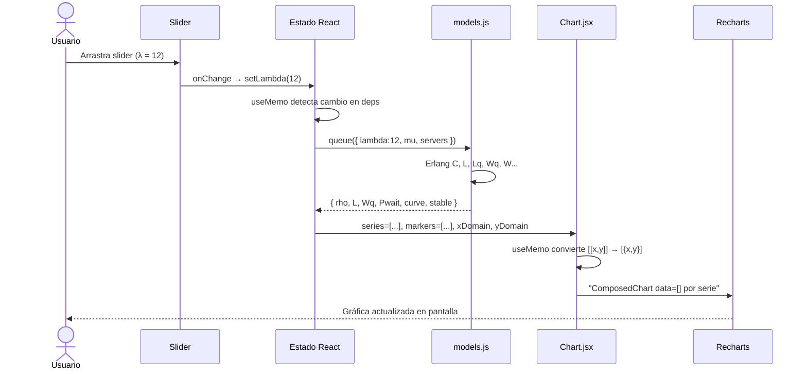
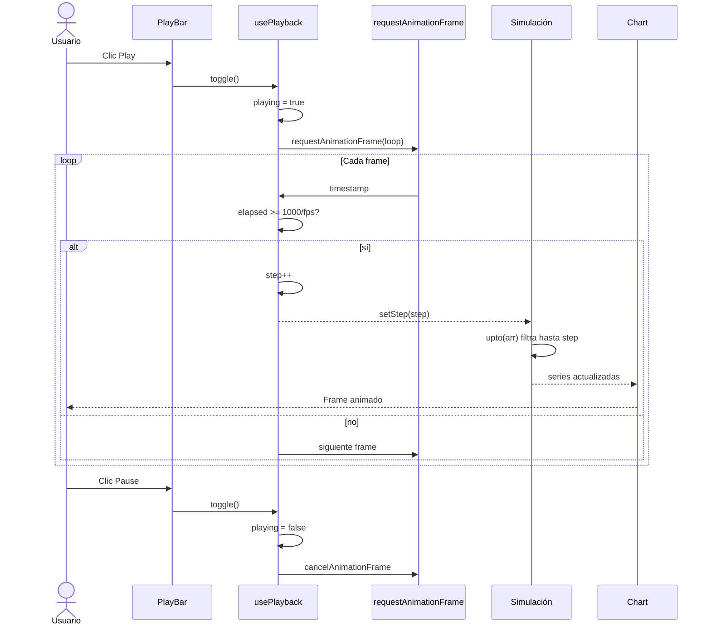
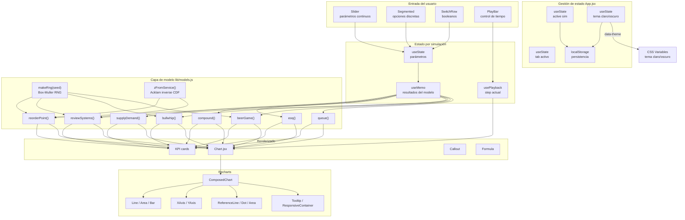
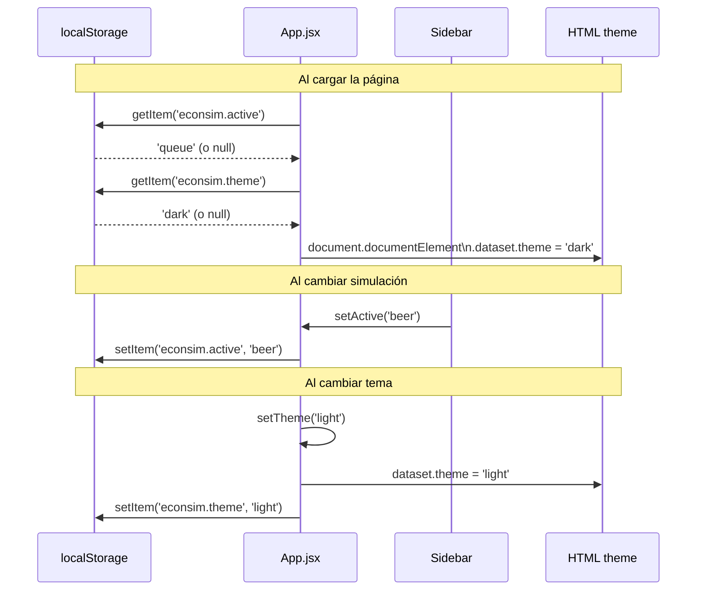
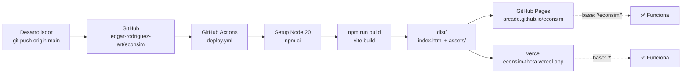

# Diagramas de Conexión — EconSim

## Flujo de Datos: Usuario → Pantalla

## Flujo de Datos: Animación Temporal

## Conexiones entre Módulos

## Conexión de Persistencia

## Conexión con Infraestructura (Deploy)

