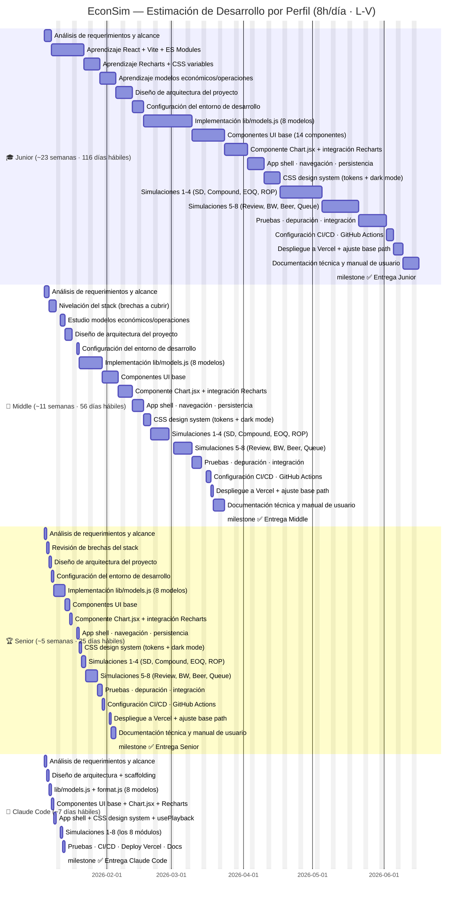
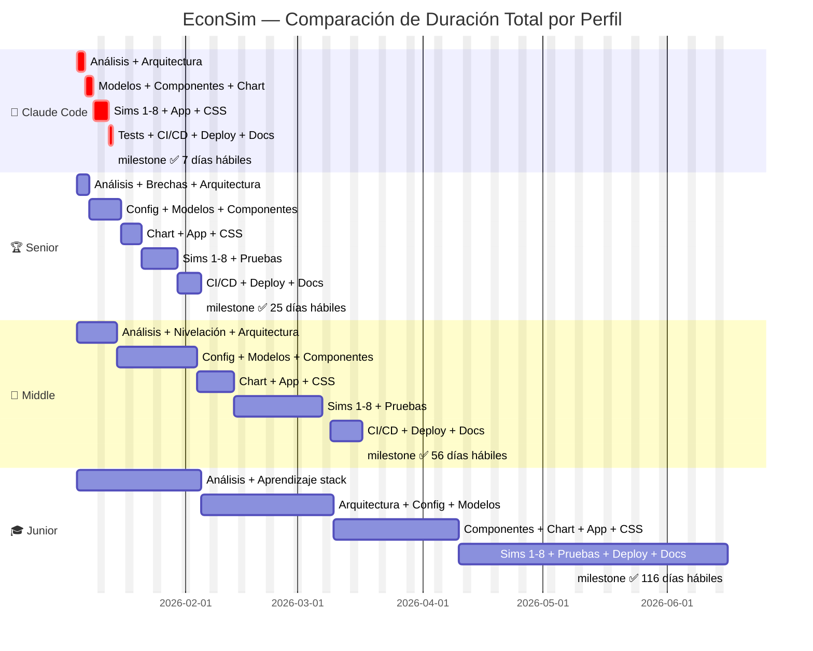

# Diagrama de Gantt — EconSim

> Jornada laboral: **8 horas/día · lunes a viernes**
> Fecha de inicio: 2026-01-05
> Las duraciones excluyen fines de semana.

---

## Gantt por Perfil (vista individual)

---

## Gantt Comparativo (todos en el mismo eje de tiempo)

---

## Resumen de Estimaciones

| Perfil | Días hábiles | Semanas | Meses aprox. | Fecha estimada de entrega |
|--------|-------------|---------|--------------|--------------------------|
| 🤖 **Claude Code** | **7 días** | **~1.5 sem** | — | **14 ene 2026** |
| 🏆 **Senior** | **25 días** | **~5 sem** | **~1.2 meses** | **10 feb 2026** |
| 💼 **Middle** | **56 días** | **~11 sem** | **~2.7 meses** | **24 mar 2026** |
| 🎓 **Junior** | **116 días** | **~23 sem** | **~5.8 meses** | **26 jun 2026** |

---

## Desglose por Fase y Perfil

| Fase | 🎓 Junior | 💼 Middle | 🏆 Senior | 🤖 Claude |
|------|-----------|-----------|-----------|-----------|
| Análisis de requerimientos | 3d | 2d | 1d | — (incluido en día 1) |
| **Aprendizaje del stack** | **20d** | **5d** | **1d** | **0d** |
| Diseño de arquitectura | 5d | 3d | 1d | — (incluido en día 2) |
| Config entorno desarrollo | 3d | 1d | 1d | — |
| lib/models.js (8 modelos) | 15d | 8d | 3d | 1d |
| Componentes UI base (×14) | 10d | 5d | 2d | — (incluido con Chart) |
| Chart.jsx + Recharts | 8d | 4d | 1d | 1d |
| App shell + CSS + routing | 10d | 6d | 2d | 1d |
| Simulaciones 1-4 | 12d | 6d | 2d | — (incluido en día 6) |
| Simulaciones 5-8 | 12d | 6d | 3d | 1d |
| Pruebas + integración | 8d | 4d | 2d | — (incluido en día 7) |
| CI/CD + GitHub Actions | 3d | 2d | 1d | — |
| Despliegue a Vercel | 2d | 1d | 1d | — |
| Documentación | 5d | 3d | 2d | 1d |
| **TOTAL** | **116 días** | **56 días** | **25 días** | **7 días** |

---

## Supuestos del Estimado

### Por perfil

**🎓 Junior**
- No conoce React, Vite, ni Recharts → 20 días de aprendizaje del stack
- Necesita investigar cada fórmula económica (Erlang C, EOQ, EWMA) antes de codificarla
- Requiere tiempo significativo de depuración en cada componente
- Puede necesitar refactorizar partes ya escritas al entender mejor el patrón del proyecto

**💼 Middle**
- Conoce React pero no Recharts ni la arquitectura ComposedChart con datos por serie
- Entiende JavaScript moderno pero puede necesitar repasar hooks avanzados (useMemo, useCallback, RAF)
- Tiene nociones de economía/operaciones pero necesita estudiar las fórmulas específicas
- Velocidad de codificación ~2× mayor que el Junior una vez superada la curva de aprendizaje

**🏆 Senior**
- Domina React, Vite, CSS variables y patrones de arquitectura frontend
- Solo necesita revisar la API de Recharts (ComposedChart, series individuales)
- Conoce los modelos económicos básicos o los entiende rápido al leer la especificación
- Escribe código production-ready desde el primer intento, sin grandes refactorizaciones

**🤖 Claude Code**
- Conoce todo el stack sin aprendizaje previo
- Genera código correcto en el primer intento para la mayoría de componentes
- El tiempo estimado incluye el pensamiento/planificación antes de cada bloque de código
- Las iteraciones con el usuario (correcciones menores, ajustes de deployment) suman ~1 día adicional
- **No duerme, no toma breaks, no tiene reuniones**
