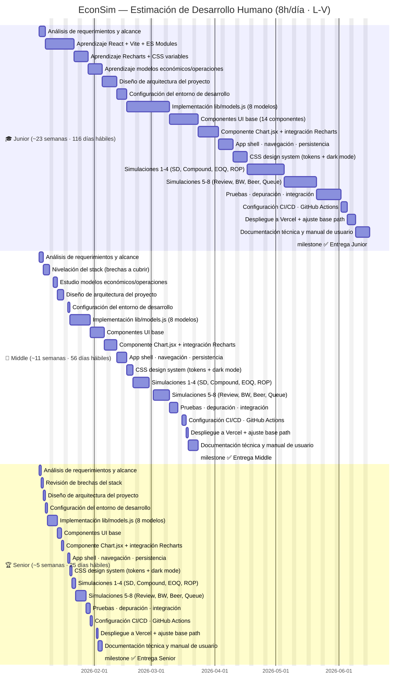
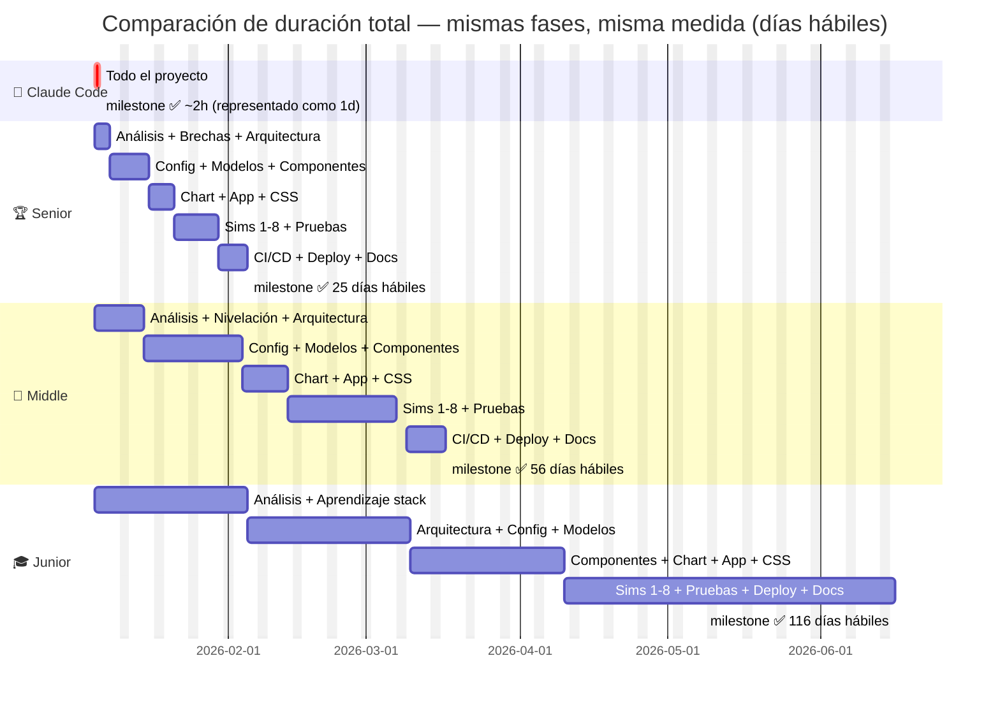

# Diagrama de Gantt — EconSim

> Jornada laboral humana: **8 horas/día · lunes a viernes**
> Fecha de inicio referencial: 2026-01-05
> Las duraciones excluyen fines de semana.

---

## Gantt por Perfil Humano (días hábiles)

---

## 🤖 Claude Code — Línea de Tiempo Real (minutos)

> Claude no trabaja en jornadas. El tiempo es de **generación activa**, sin pausas, sin reuniones, sin sueño.

```mermaid
gantt
    title Claude Code — Tiempo real de generación (~131 minutos)
    dateFormat  HH:mm
    axisFormat  %H:%M h

    section 🤖 Claude Code  (2 horas 11 minutos)
    Lectura README-handoff + análisis            :c1,  00:00,  5m
    Diseño de arquitectura + decisiones técnicas :c2,  after c1,  5m
    package.json · vite.config · index.html      :c3,  after c2,  5m
    lib/models.js  (8 modelos · 362 líneas)      :crit, c4,  after c3, 15m
    lib/format.js + src/theme.css                :c5,  after c4, 11m
    src/main.jsx + src/App.jsx (shell + nav)     :c6,  after c5, 12m
    14 componentes UI base                       :crit, c7,  after c6, 15m
    Chart.jsx + wrapper Recharts                 :crit, c8,  after c7, 10m
    usePlayback.js (animación RAF)               :c9,  after c8,  5m
    8 Simulaciones (SupplyDemand→Queue)          :crit, c10, after c9, 20m
    Pruebas npm run build · corrección errores   :c11, after c10,  5m
    CI/CD GitHub Actions · ajuste base path      :c12, after c11,  8m
    Documentación técnica (7 archivos · 1314 lín):c13, after c12, 15m
    milestone ✅ Total: 131 minutos              :mc,  after c13,  0m
```

---

## Comparación de Escala (perspectiva)

> ⚠️ La barra de **Claude Code** está representada con **1 día mínimo** por limitaciones de escala del diagrama.
> Su tiempo real fue **~131 minutos** de generación activa — equivalente al **0.86% del tiempo del Senior**.

---

## Resumen de Estimaciones

| Perfil | Tiempo real | Equivalente hábil | Fecha estimada de entrega |
|--------|-------------|-------------------|--------------------------|
| 🤖 **Claude Code** | **~131 minutos** | — | **mismo día** |
| 🏆 **Senior** | **25 días hábiles** | ~5 semanas | **10 feb 2026** |
| 💼 **Middle** | **56 días hábiles** | ~11 semanas | **24 mar 2026** |
| 🎓 **Junior** | **116 días hábiles** | ~23 semanas | **26 jun 2026** |

---

## Desglose por Fase

| Fase | 🎓 Junior | 💼 Middle | 🏆 Senior | 🤖 Claude Code |
|------|-----------|-----------|-----------|----------------|
| Análisis de requerimientos | 3d | 2d | 1d | **5 min** |
| Aprendizaje del stack | **20d** | **5d** | **1d** | **0 min** |
| Diseño de arquitectura | 5d | 3d | 1d | **5 min** |
| Config entorno desarrollo | 3d | 1d | 1d | **5 min** |
| lib/models.js (8 modelos) | 15d | 8d | 3d | **15 min** |
| format.js + theme.css | 5d | 3d | 1d | **11 min** |
| main.jsx + App.jsx | 5d | 3d | 1d | **12 min** |
| 14 Componentes UI base | 10d | 5d | 2d | **15 min** |
| Chart.jsx + Recharts | 8d | 4d | 1d | **10 min** |
| usePlayback.js | 2d | 1d | 1d | **5 min** |
| Simulaciones 1-8 | 24d | 12d | 5d | **20 min** |
| Pruebas + integración | 8d | 4d | 2d | **5 min** |
| CI/CD + GitHub Actions | 3d | 2d | 1d | **8 min** |
| Documentación | 5d | 3d | 2d | **15 min** |
| **TOTAL** | **116 días** | **56 días** | **25 días** | **131 min** |

---

## Supuestos del Estimado

**🎓 Junior**
- No conoce React, Vite, ni Recharts → 20 días de aprendizaje del stack
- Necesita investigar cada fórmula económica (Erlang C, EOQ, EWMA) antes de codificarla
- Requiere tiempo significativo de depuración en cada componente
- Puede necesitar refactorizar partes ya escritas al entender mejor el patrón del proyecto

**💼 Middle**
- Conoce React pero no Recharts ni la arquitectura `ComposedChart` con datos por serie
- Entiende JavaScript moderno pero puede necesitar repasar hooks avanzados (useMemo, RAF)
- Tiene nociones de economía/operaciones pero necesita estudiar las fórmulas específicas
- Velocidad ~2× mayor que el Junior una vez superada la curva de aprendizaje

**🏆 Senior**
- Domina React, Vite, CSS variables y patrones de arquitectura frontend
- Solo necesita revisar la API de Recharts (ComposedChart, series individuales)
- Conoce los modelos económicos básicos o los entiende rápido al leer la especificación
- Escribe código production-ready desde el primer intento, sin grandes refactorizaciones

**🤖 Claude Code**
- Sin aprendizaje previo necesario — conoce todo el stack desde el inicio
- Genera código correcto en el primer intento para la mayoría de casos
- No tiene tiempo de "pensar" entre tareas — genera en paralelo mientras razona
- Los 131 minutos incluyen lectura, razonamiento, generación de código y documentación
- No duerme · no toma breaks · no tiene reuniones · no navega Stack Overflow
- El tiempo de espera de aprobaciones del usuario **no está incluido** en los 131 minutos
