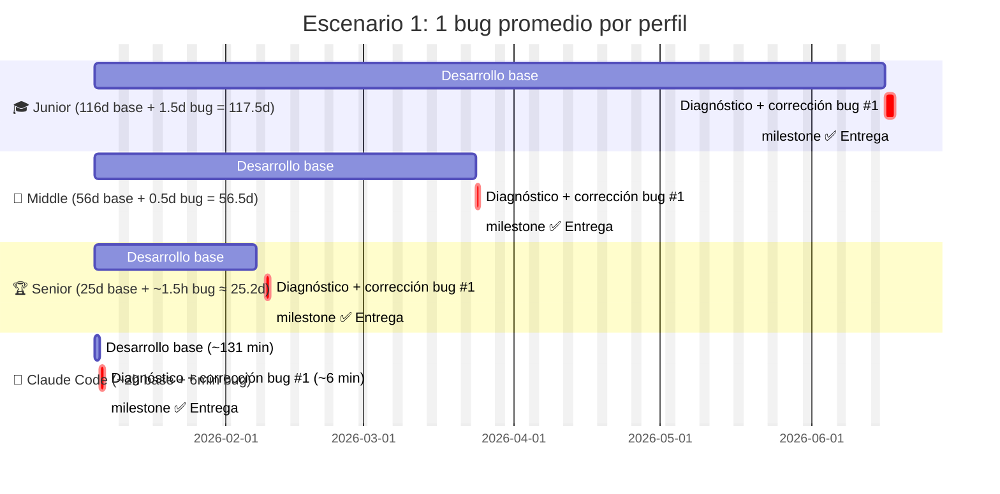
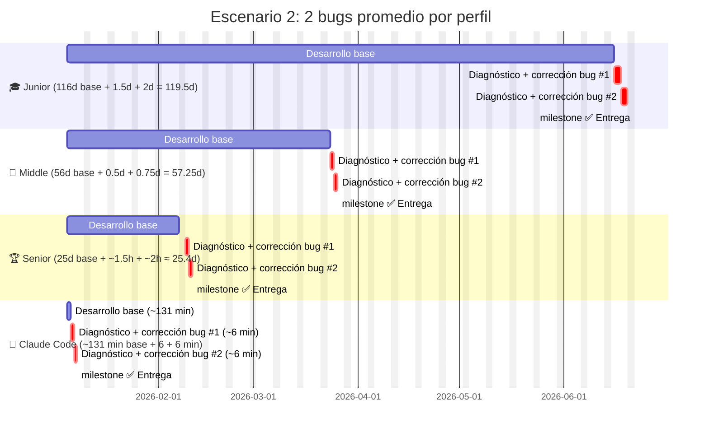
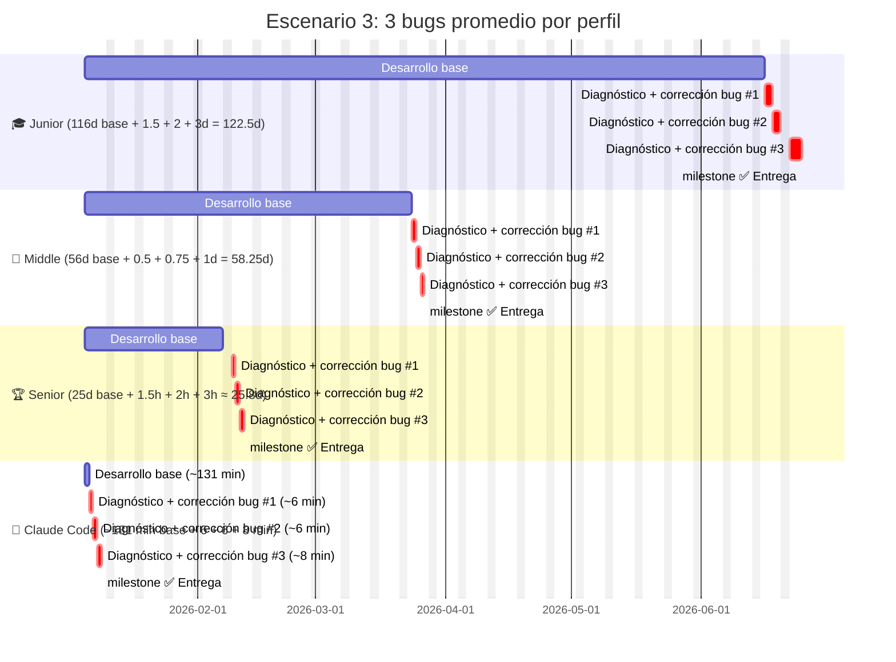

# Gantt con Estimación de Corrección de Errores — EconSim

> Jornada laboral humana: **8 horas/día · lunes a viernes**
> Los bugs modelados son de **complejidad promedio**, representativos del stack
> React + Recharts + modelos matemáticos de este proyecto.

---

## Tipos de bug considerados

Para este proyecto los errores más probables son de tres categorías:

| Tipo | Descripción | Ejemplo real del proyecto |
|------|-------------|--------------------------|
| **A — Integración/Render** | La gráfica no muestra datos o aparece en blanco | Series de Recharts en formato `[[x,y]]` en lugar de `[{x,y}]` |
| **B — Lógica de modelo** | Cálculo incorrecto en un modelo matemático | Signo erróneo en Erlang C, factorial mal aplicado en M/M/c |
| **C — Estado React** | El parámetro cambia pero la UI no se actualiza | Dependencia faltante en `useMemo`, closure desactualizado |

---

## Tiempo promedio de resolución por perfil y tipo de bug

| Perfil | Bug tipo A | Bug tipo B | Bug tipo C | **Promedio** |
|--------|-----------|-----------|-----------|-------------|
| 🎓 Junior | 1d | 2d | 1.5d | **~1.5d / bug** |
| 💼 Middle | 4h | 6h | 4h | **~5h / bug** |
| 🏆 Senior | 1h | 2h | 1.5h | **~1.5h / bug** |
| 🤖 Claude Code | 5min | 7min | 6min | **~6min / bug** |

> **Por qué el Junior escala más que los demás:** no tiene patrones de debugging establecidos. Puede pasar horas en el síntoma sin llegar a la causa. El segundo y tercer bug suelen tardar más porque la confianza en el código propio ya está afectada.

---

## Escenario 1 — Un (1) bug detectado

---

## Escenario 2 — Dos (2) bugs detectados

> El segundo bug suele ser más difícil: puede ser una consecuencia del primero, o aparecer en una parte del código ya "conocida" generando falsa confianza.

---

## Escenario 3 — Tres (3) bugs detectados

> Con tres bugs, el Junior experimenta **fatiga de depuración**: el tercer problema puede ser el más simple de todos pero toma el doble de tiempo por pérdida de confianza, saltos entre hipótesis y código cada vez más difícil de seguir mentalmente.

---

## 🤖 Claude Code — Escenarios de bugs en tiempo real (minutos)

```mermaid
gantt
    title Claude Code — Impacto de bugs en tiempo real (minutos)
    dateFormat  HH:mm
    axisFormat  %H:%M h

    section Sin bugs (base)
    Desarrollo completo                      :cb0, 00:00, 131m
    milestone ✅ 131 min                      :mcb0, after cb0, 0m

    section 1 bug
    Desarrollo base                          :cb1_base, 00:00, 131m
    Corrección bug #1                        :crit, cb1_b1, after cb1_base, 6m
    milestone ✅ 137 min                      :mcb1, after cb1_b1, 0m

    section 2 bugs
    Desarrollo base                          :cb2_base, 00:00, 131m
    Corrección bug #1                        :crit, cb2_b1, after cb2_base, 6m
    Corrección bug #2                        :crit, cb2_b2, after cb2_b1,   6m
    milestone ✅ 143 min                      :mcb2, after cb2_b2, 0m

    section 3 bugs
    Desarrollo base                          :cb3_base, 00:00, 131m
    Corrección bug #1                        :crit, cb3_b1, after cb3_base, 6m
    Corrección bug #2                        :crit, cb3_b2, after cb3_b1,   6m
    Corrección bug #3                        :crit, cb3_b3, after cb3_b2,   8m
    milestone ✅ 151 min                      :mcb3, after cb3_b3, 0m
```

---

## Tabla de Impacto Total

| Perfil | 0 bugs (base) | + 1 bug | + 2 bugs | + 3 bugs | Δ máx (3 bugs) |
|--------|--------------|---------|---------|---------|----------------|
| 🎓 **Junior** | 116d | 118d | 120d | **123d** | **+7 días** |
| 💼 **Middle** | 56d | 57d | 58d | **59d** | **+3 días** |
| 🏆 **Senior** | 25d | 26d | 27d | **28d** | **+3 días** |
| 🤖 **Claude Code** | 131 min | 137 min | 143 min | **151 min** | **+20 min** |

---

## Observaciones clave

**Por qué los bugs afectan más al Junior en términos relativos:**
El tiempo extra de 7 días representa el **+6%** sobre su base de 116 días, pero la experiencia subjetiva es muy distinta: cada bug genera dudas sobre el resto del código, búsquedas en Stack Overflow, pruebas de soluciones incorrectas y a veces regresiones nuevas.

**Por qué el Senior apenas se mueve:**
3 bugs equivalen a ~6.5 horas adicionales. El Senior reconoce el patrón del error antes de reproducirlo — su modelo mental del sistema es lo suficientemente sólido como para ir directo a la causa raíz.

**Por qué Claude Code es prácticamente invariante:**
20 minutos adicionales sobre 131 es un **+15%** en tiempo pero **0%** en estrés, sin fatiga, sin confianza afectada, sin búsquedas externas. El cuarto bug tarda lo mismo que el primero. No hay degradación de rendimiento por cantidad de problemas acumulados.

**La asimetría más importante:**
Los bugs no solo agregan tiempo — agregan **incertidumbre**. Un Junior con 3 bugs no sabe si hay un cuarto. Un Senior tampoco, pero su umbral de confianza es mucho más alto. Claude Code resuelve el bug, verifica el fix, y continúa sin cargar ese peso cognitivo al siguiente problema.
